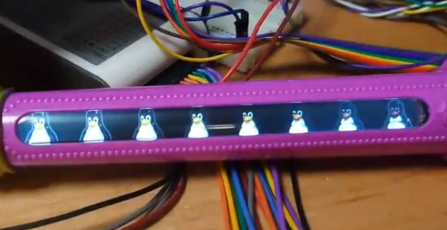
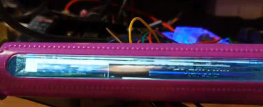
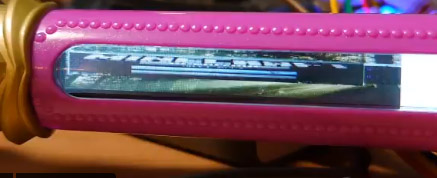

# Driver for majoca Iris LCD (mod)

マジョカアイリスLCD の ラズパイ用 mod ドライバーです。

フレームバッファとして使えるようになります。

（カーネルのバージョンによって2種に別れてしまったので、`uname -r` コマンドでご自身のバージョンを確認し、使うブランチを選んでください。）

# 動いてる様子


### ブランチ master　(kernel 5.4 用) 

(Raspberry Pi OS , 2021-1-11 リリースで動作確認したものです。**描画が速くなってます。**)







https://twitter.com/devemin/status/1351198449442709508

https://twitter.com/devemin/status/1351214926707175432

https://twitter.com/devemin/status/1351187167314325506

https://twitter.com/devemin/status/1351338649116311552


### ブランチ for4.x　 (kernel 4.x 用)　→　https://github.com/devemin/fbtft/tree/for4.x

 (4.x カーネル版用で、描画遅いです。)


https://twitter.com/devemin/status/1349725112660946947

https://twitter.com/devemin/status/1349741702236364807

https://twitter.com/devemin/status/1349736972139388929

https://twitter.com/devemin/status/1349763128960053250


### kernel バージョン確認方法

```
uname -r
```


# 確認環境

ラズパイ4 8gB /  2021-1-11 released Raspberry Pi OS, カーネル 5.4.83-v7l+

ラズパイ3B+ /  2021-1-11 released Raspberry Pi OS, カーネル 5.4.83-v7+

（2019/4/8 release のラズパイimage(stretch, kernel 4.14) では、ビルドが通ってもデバイス認識できませんでした。for 4.x ブランチを使ってください。）


# HOWTO


# マジョカアイリスLCD の配線

```
LCD :	ラズパイ
reset:	21
DC:	22
WR:	23
CS:	24
DB0:	5
DB1:	6
DB2:	13
DB3:	19
DB4:	26
DB5:	12
DB6:	16
DB7:	20
```


### 配線の様子


### GPIO ピン配置　参考

→　https://deviceplus.jp/hobby/raspberrypi4_04/

### 細長液晶側のピン配置

→　https://github.com/htlabnet/inside_magimajopures/blob/main/640x48_LCD_ESP32/640x48_LCD_ESP32.ino


# インストール

```
# カーネルソースの準備

sudo apt update 
sudo apt install git bc bison flex libssl-dev
sudo wget https://raw.githubusercontent.com/RPi-Distro/rpi-source/master/rpi-source -O /usr/local/bin/rpi-source && sudo chmod +x /usr/local/bin/rpi-source && /usr/local/bin/rpi-source -q --tag-update
sudo rpi-source

#https://github.com/RPi-Distro/rpi-source
#/root/内にLinux カーネルソース一式が、サクサクッと準備されます。
#また、/lib/modules/x.x.x.../build にシンボリックリンクが作成されます。
#以上で、カーネルモジュールをビルドする環境が作られたことになります。
#参考　https://qiita.com/RCA3610/items/02d8274d78ee8c26e8c9
```


```
# ドライバをビルド
cd
git clone https://github.com/devemin/fbtft
cd fbtft
sudo make -j4
```


```
#デバイスツリーをコピー

dtc -I dts -O dtb -o majocairis.dtbo majocairis.dts
sudo cp majocairis.dtbo /boot/overlays/

#dts 情報とても参考になりました。Thanks! : Twitter @Akkiesoft さん　https://twitter.com/Akkiesoft
#https://gist.github.com/Akkiesoft/86446a431190709bec47877626a5623f

```


```
#ドライバをロード
./majoins.sh

#gpioの接続が正しければ、液晶が暗転します。

#ドライバをアンロード
./majorm.sh

#再起動すると登録は解除されます。必要な場合は、スクリプト起動時実行を設定しましょう。
```

# フレームバッファ遊び方

## qiita にも簡単にまとめました。

### マジョカアイリス細長液晶をラズパイで使う

https://qiita.com/devemin/items/9a3a3d40538b782b39d2


ソフト等

https://github.com/notro/fbtft/wiki/Framebuffer-use

fbcpでデスクトップ写すのが面白いですね。　あとは fbi 等

（con2fbmap はsudo raspi-config のブートのところをコンソールブートにしないと、GUIブートだとできなそう？というかできなかった）

https://qiita.com/kitazaki/items/9f6119d7dc21cd29268e

fbtest　（描画テスト）

このあたりのページが参考になります。

```
git clone https://git.kernel.org/pub/scm/linux/kernel/git/geert/fbtest.git
cd fbtest
make
./fbtest -f /dev/fb1
```

自分のコードからアクセスする場合は、

フレームバッファ /dev/fb1 をpython なりC なりでopen してバイナリ書き込めば、画面にその色が出ます。

今回は、640x48x16bit の配列になり、BGR 16bit で格納されてます

web の情報をご参照ください。


# トラブルシューティング

2021/1/11 release イメージの新規インストール環境で実際に試していますが、画面が出ない場合は
pin 配線と波形をご確認ください。

液晶がノイズに弱いらしい？というのも、考慮が必要かもしれません。

（実際は、Reset: 3.3V, RD: 3.3V, CS: GND でも大丈夫かも？）

一応波形サンプル

→　https://github.com/devemin/fbtft/blob/master/img/hakei1.png

→　https://github.com/devemin/fbtft/blob/master/img/hakei2.png


# 補足

```
#frame buffer 何があるか確認
ls /dev/fb*
#/dev/fb0 は基本的にGUI(startXではじまるX11環境)
#/dev/fb1 に今回のマジョカアイリス液晶がfbtftによって登録される
#GUI なしのCUI コンソールログインだと、それが番号ずれることもある


#fbtft関連のドライバの読み込み状況確認
lsmod | grep fb

#ドライバ１個ずつロード
sudo insmod xxx
#ドライバ１個ずつアンロード
sudo rmmod xxx

#カーネルバージョン確認
uname -r

```

insmod はモジュール（ドライバ）を１個ずつロードします。

modprobe はモジュールをうまいこと関連のものを一緒にまとめてロードしてくれます。


以下、original README

  FBTFT
=========

Linux Framebuffer drivers for small TFT LCD display modules.
The module 'fbtft' makes writing drivers for some of these displays very easy.

Development is done on a Raspberry Pi running the Raspbian "wheezy" distribution.

INSTALLATION
  Download kernel sources

  From Linux 3.15
    cd drivers/video/fbdev/fbtft
    git clone https://github.com/notro/fbtft.git

    Add to drivers/video/fbdev/Kconfig:   source "drivers/video/fbdev/fbtft/Kconfig"
    Add to drivers/video/fbdev/Makefile:  obj-y += fbtft/

  Before Linux 3.15
    cd drivers/video
    git clone https://github.com/notro/fbtft.git

    Add to drivers/video/Kconfig:   source "drivers/video/fbtft/Kconfig"
    Add to drivers/video/Makefile:  obj-y += fbtft/

  Enable driver(s) in menuconfig and build the kernel


See wiki for more information: https://github.com/notro/fbtft/wiki


Source: https://github.com/notro/fbtft/
